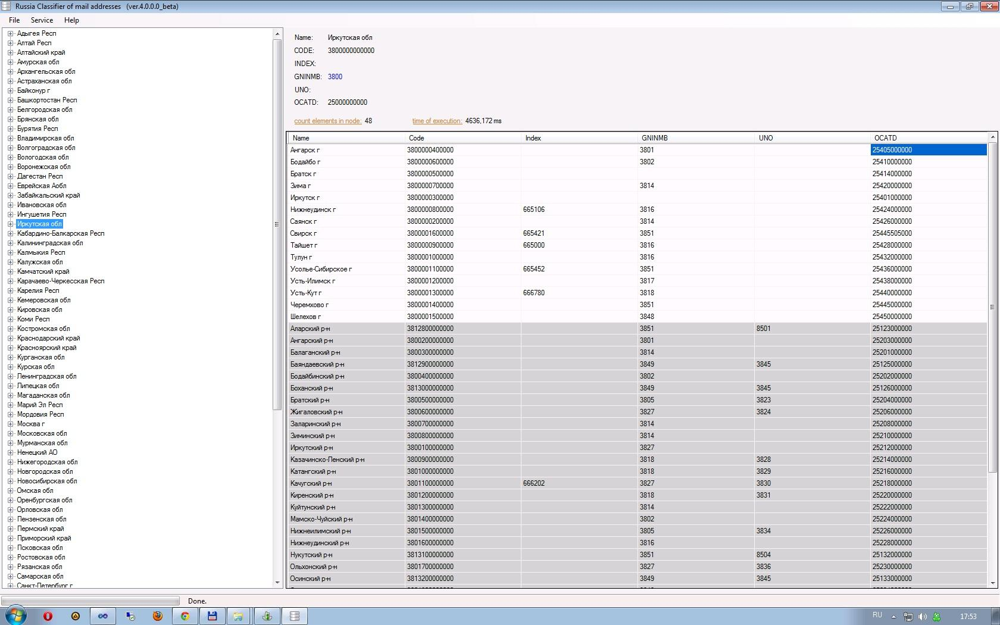
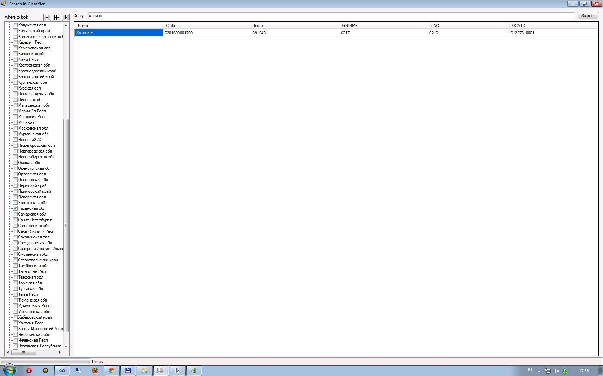
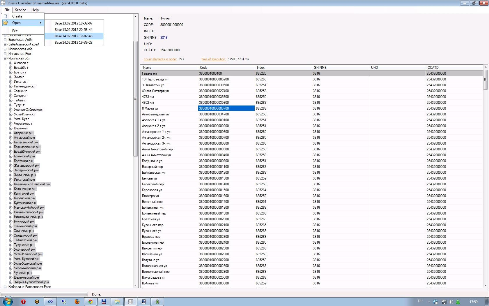
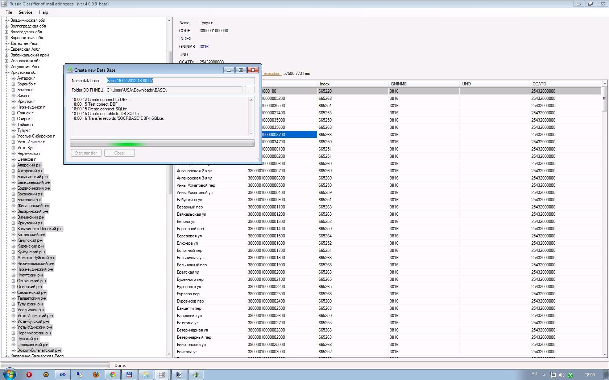

# kladr-viewer
КЛАДР-браузер

Программа для просмотра данных из КЛАДР.

1) Скачиваете официальные базы КЛАДР-а тут https://www.gnivc.ru/technical_support/classifiers_reference/kladr/

2) Распаковываете полученный архив в любую папку на компьютере (в папке должны оказаться файлы ALTNAMES.DBF, DOMA.DBF, FLAT.DBF, KLADR.DBF, SOCRBASE.DBF, STREET.DBF).

3) Запускаете мою программу и выбираете File->Create, а там указываете папку куда была распакована база данных КЛАДР и её имя (при желании). Запускаете импорт и ждете несколько минут.

4) Если база КЛАДР была удачно импортирована выбирайте File->Open и нужную БД. 

 - Мультиязычность English, Deutsch, Русский (перечень будет расширяться)
 - Не требует установки
 - Можно сразу из программы попасть на Internet страницу Яндекс.Карт выбранного объекта КЛАДР и/или страницу информации для почтового отделения выбранного населённого пункта.
 - Поддержка официальных файлов КЛАДР от ФГУП ГНИВЦ ФНС России (http://www.gnivc.ru/inf_provision/classifiers_reference/kladr/)
 - Поиск по базе КЛАДР-а (полнотекстовый поиск). Можно искать по наименованию, части наименования, индексу, коду. Можно искать с применением T-SQL выражений в режиме LIKE
 - При поиске в базе КЛАДР можно искать как по простому регистронезависемому выражению (просто фраза введённая в поле поиска будет обрамлена в %% и например слово канино превратится в %канино% и не будет зависеть от регистра написания), так и с применением T-SQL выражений (если выражение обрамить в фигурные скобки {}, то выражение будет применено как есть. Например {кан_н%} будет воспринято как T-SQL выражение кан_н% и символы _ и % будут восприняты как описано в T-SQL).
 - Есть возможность ведения нескольких баз КЛАДР-а (количество БД не ограничено)
 - Программа позволяет удобно просматривать весь состав классификатора (регионы, районы, населённые пункты, улицы и т.д.).
 - Начиная с версии 4.0.1.0 реализовано кеширование за счёт чего скорость обработки выбора узлов вырастает в несколько раз (например на тестовой машине узел "Архангеьская область" в первый раз открывается за 814 миллисекунд, а все последующие разы за 40 миллисекунд. Прирост производительности в 20 раз. В отдельных случаях фиксировался прирост скорости производительности в 150 раз и более)
 - Начиная с версии 4.0.2.0 реализован импорт данных в CSV. Таким образом при помощи программы можно импортировать данные в MySQL и другие информационные системы через распространённый формат CSV. Инструмент разрабатывался для работы с базами КЛАДР, но не ограничен этим. Другими словами инструмент можно использовать для импорта из любых других DBF файлов без ограничения.
 - Начиная с версии 4.0.2.0 в программе можно указать расположение баз данных. Таким образом можно работать по сети с единой БД или просто изменить расположение рабочего каталога программы.
 - Начиная с версии 4.0.2.0 в программе можно указать время таймаута обработки запроса для запуска механизма кеширования (ранее он был статичный в 150 ms) Стоит заметить, что время "обработки запроса" и "время исполнения", который находится на форме программы не одно и то же. Время исполнения складывается из "времени запроса" и "времени заполнения" формы данными.
 - Начиная с версии 4.0.4.8 Выводятся скрытые объекты БД КЛАДР. Такие объекты в БД обычно являются старыми названиями адресных данных. Например если улица А и улица Б объединятся в улицу К, то в БД заведётся новый активный элемент К, а объекты А и Б удалят не сразу. Сначала их помечают как не активные и спустя какое то количество обновлений БД скрытые элементы не выводятся.
 - Начиная с версии 4.0.5.0 Пофиксен механизм поиска почтового отделения объекта.
 - С версии 4.0.6.0 можно фильтровать поиск (искать только населённые пункты или только улицы)
 
 
 
 
 
 